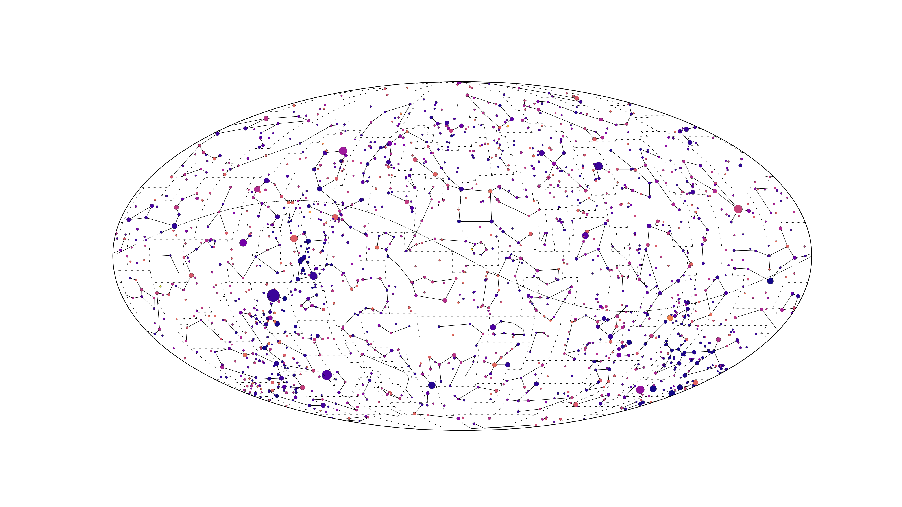
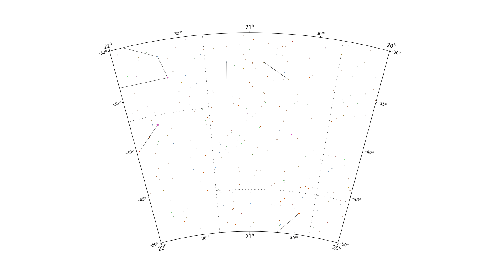

# Star Maps
A wee exploration into making star maps using cartopy. They are roughly modelled off of Antonín Bečvář's star maps - present our local observatory.

It uses data from Hipparcos, through VizieR.

### Example Outputs:

